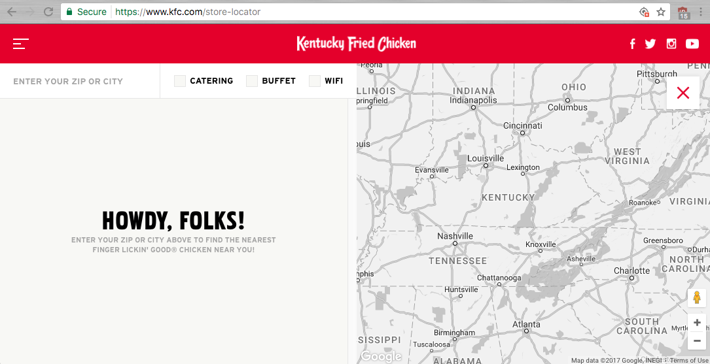
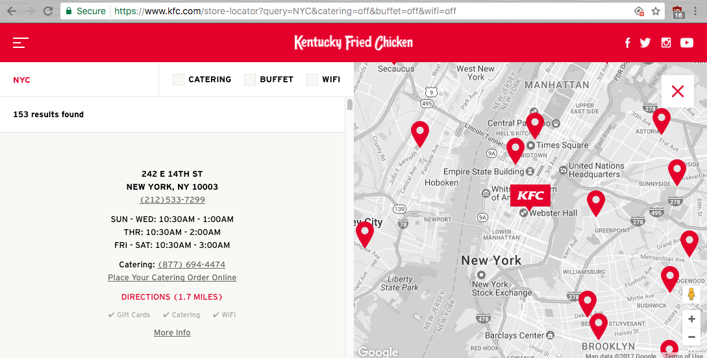
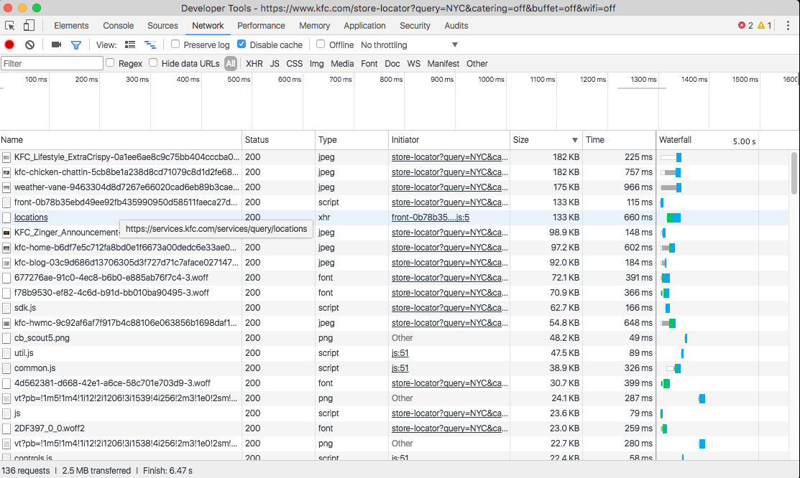
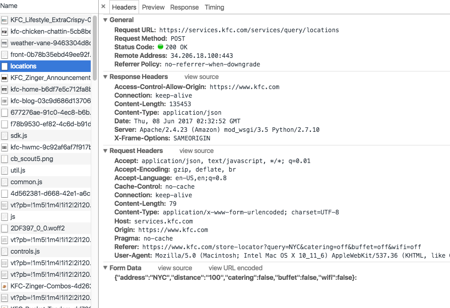

# kfc-scrape


# Manual walkthrough to find the data

KFC's store locator tool can be found here: 

https://www.kfc.com/store-locator

The user is prompted for their zip or city (and presumably *state*) location. There's also optional filters to find locations that feature catering, buffet, and/or wifi:





Typing in `NYC` as a sample search returns results like these:



And we can see that the URL includes serialized arguments, of which `query=NYC` is the key-value pair we care about:

https://www.kfc.com/store-locator?query=NYC&catering=off&buffet=off&wifi=off

## Using web inspector

Pop-open the Network Panel of your web inspector, refresh the search, and you'll see that a XHR request is made to the `locations`  endpoint (the full URL is `https://services.kfc.com/services/query/locations`):



Click the `locations` entry and view its **Headers**: looks like a standard **POST** request with the search parameters sent as form data:



Of particular note is the `distance` attribute in the form data, set to a default value of `100`.


## Making the request with Python's Requests

```py
import requests
BASE_ENDPOINT = 'https://services.kfc.com/services/query/locations'
search_params = { 'address': 'NYC', 'distance': '100', 
                  'catering': False, 'buffet': False, 'wifi': False }

resp = requests.post(BASE_ENDPOINT, data=search_params)
```

Calling the `.json()` method of the `resp` response object yields a Python dict that includes a list of 153 locations. You can see a cached version of that JSON at [assets/data/cached-nyc-kfc-locations.json](assets/data/cached-nyc-kfc-locations.json)

### Customizing the request

So it seems pretty straightforward to call the KFC locator service repeatedly, iterating over U.S. addresses, until we've covered the entirety of the United States. The most obvious optimization is to change the `distance` in the request to be bigger than `100` (miles, presumably). Changing it to `200` would reduce the number of calls needed to cover the U.S.

In the snippet below, note the change of `distance` from `100` to `200`:

```py
import json
import requests

BASE_ENDPOINT = 'https://services.kfc.com/services/query/locations'
search_params = { 'address': 'NYC', 'distance': '100', 
                  'catering': False, 'buffet': False, 'wifi': False }

resp = requests.post(BASE_ENDPOINT, data=search_params)
```


Let's do a quick check of the dictionary as deserialized from the `resp` object (the `total` number of results was **153** when the `distance` was set to `100`):

```py
>>> result = json.loads(resp.text)
>>> result['total']
```


